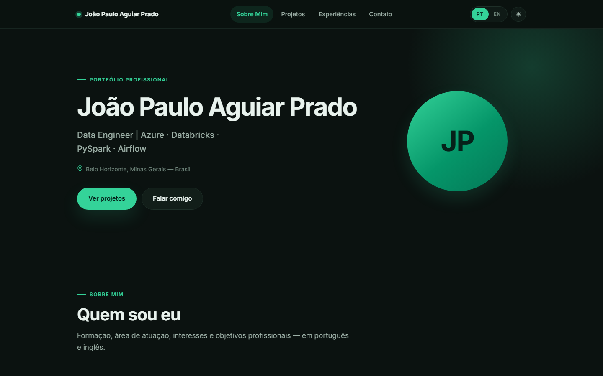
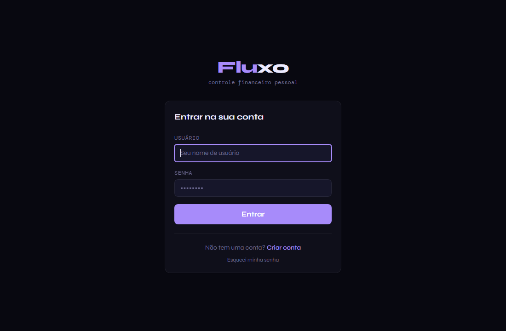
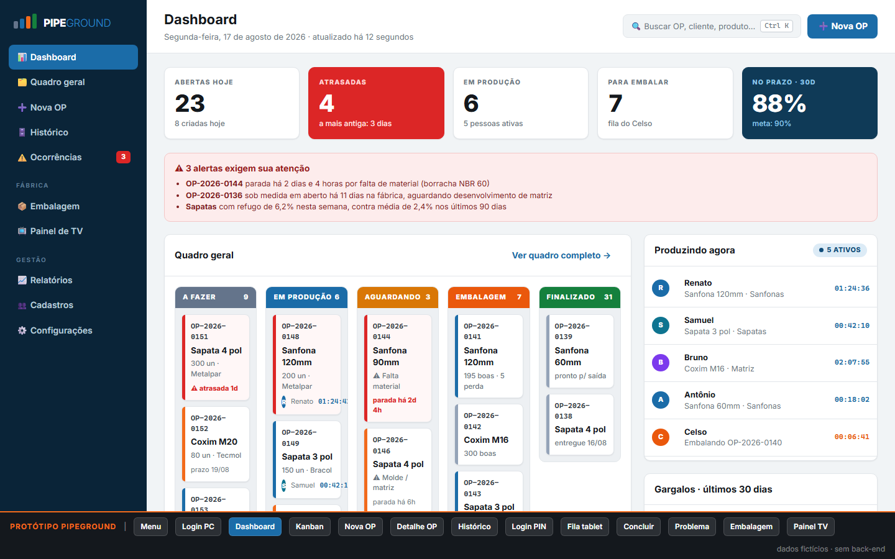
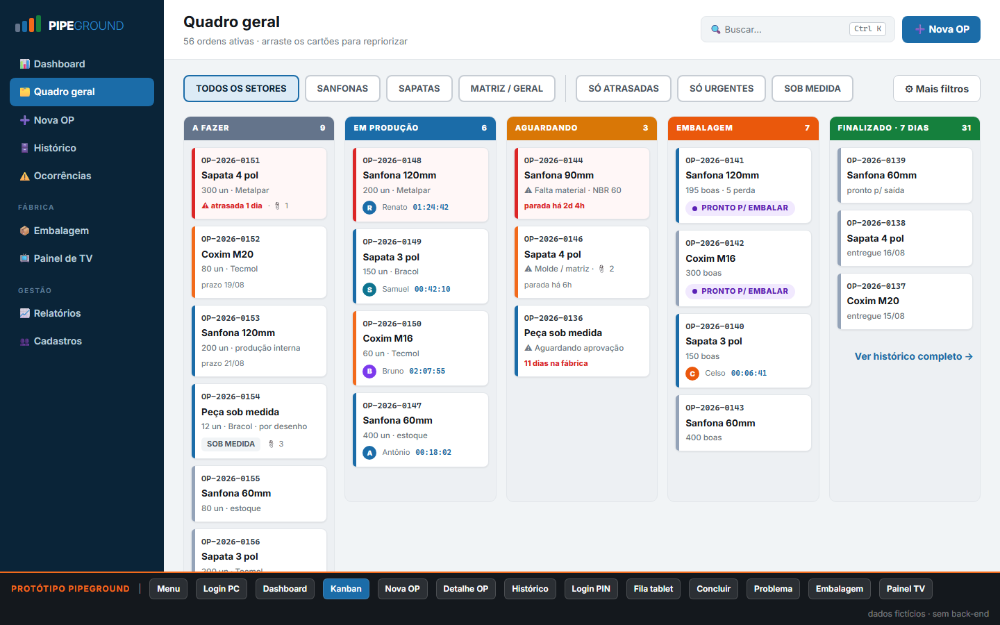
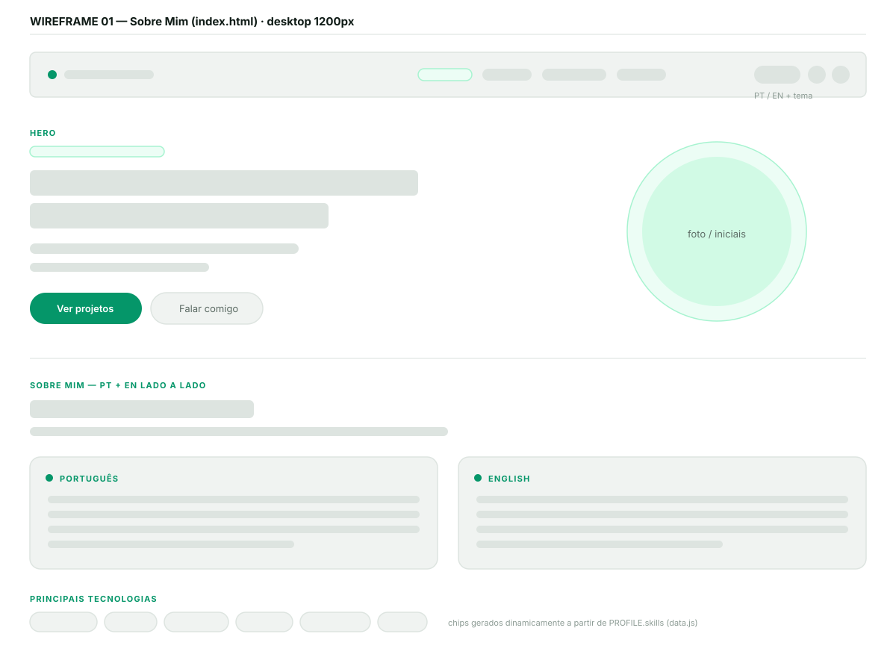
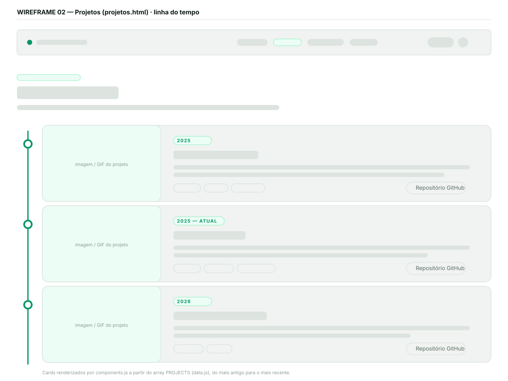
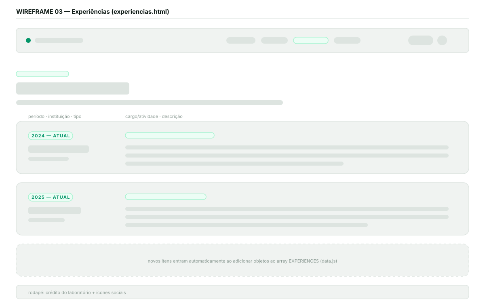
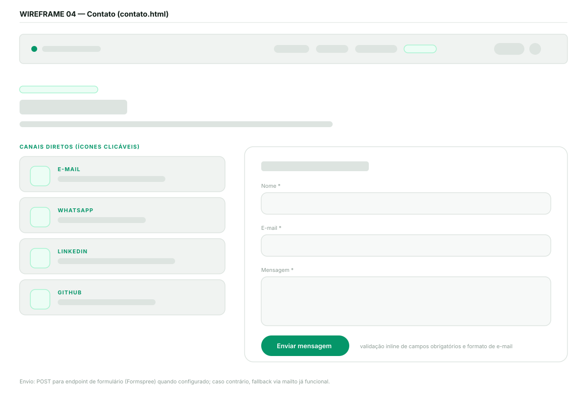

# Portfólio Profissional — João Paulo Aguiar Prado

Website de portfólio profissional desenvolvido para o **Laboratório 1 da disciplina Projeto de Software** (Engenharia de Software — PUC Minas, 2º semestre/2026).

O site apresenta trajetória, habilidades, projetos e formas de contato, com conteúdo bilíngue (português e inglês), tema claro/escuro e layout totalmente responsivo.

🔗 **Site publicado:** https://jotaaguiar.github.io/lab_DesenvolvimentSoftware_E01/

> **Aluno:** João Paulo Aguiar Prado
> **Disciplina:** Projeto de Software — Profa. Milena Menezes Adão
> **LinkedIn:** https://www.linkedin.com/in/joaoaguiarprado/
> **Repositório:** https://github.com/jotaaguiar/lab_DesenvolvimentSoftware_E01

---

## Índice

- [Status das sprints](#status-das-sprints)
- [Funcionalidades](#funcionalidades)
- [Telas do site](#telas-do-site)
- [Protótipos e wireframes](#protótipos-e-wireframes)
- [Tecnologias utilizadas](#tecnologias-utilizadas)
- [Dependências e bibliotecas](#dependências-e-bibliotecas)
- [Estrutura de diretórios](#estrutura-de-diretórios)
- [Instalação e execução local](#instalação-e-execução-local)
- [Hospedagem e deploy](#hospedagem-e-deploy)
- [Arquitetura do front-end](#arquitetura-do-front-end)
- [Como atualizar o conteúdo](#como-atualizar-o-conteúdo)

---

## Status das sprints

| Sprint | Entrega | Status |
|--------|---------|--------|
| **Lab01S01** | Repositório com README inicial, wireframes de média fidelidade, protótipo do front-end, navegação e layout principal (cabeçalho, rodapé, área de conteúdo) | ✅ Concluída |
| **Lab01S02** | Página "Sobre Mim" em PT/EN, "Projetos" com timeline dinâmica, "Experiências" com dados organizados, "Contato" com ícones e formulário funcional, validações e responsividade | ✅ Concluída |
| **Lab01S03** | Deploy no GitHub Pages, ajustes visuais e de usabilidade, imagens dos projetos em execução e README final | ✅ Concluída |

---

## Funcionalidades

### Sobre Mim (`index.html`)
- Hero com nome, cargo, localização e chamadas para ação.
- Apresentação **em português e em inglês exibidas lado a lado**, conforme exigido no enunciado.
- Lista de tecnologias dominadas, renderizada dinamicamente.
- Resumo numérico (projetos, tecnologias e experiências) calculado a partir dos dados.

### Projetos (`projetos.html`)
- **Linha do tempo dinâmica**, do projeto mais antigo ao mais recente.
- Cada card contém: nome, período, descrição bilíngue, tecnologias utilizadas, link para o repositório no GitHub, link para demo e **imagem do projeto em funcionamento**.

### Experiências (`experiencias.html`)
- Cards com empresa/instituição, tipo de vínculo, período, cargo ou atividade e descrição, cobrindo estágio, monitorias na PUC Minas e as posições de Data Engineer.
- Seções adicionais de **formação acadêmica** e **licenças e certificados**, ambas opcionais (somem automaticamente se não houver dados).

### Contato (`contato.html`)
- **Ícones clicáveis** para e-mail, WhatsApp, LinkedIn e GitHub (cards gerados automaticamente — canais não preenchidos simplesmente não aparecem).
- **Formulário com nome, e-mail e mensagem**, com envio por e-mail.
- **Validações**: campos obrigatórios, formato de e-mail e tamanho mínimo da mensagem, com mensagens de erro inline traduzidas em tempo real.

### Recursos globais
- **Bilíngue (PT/EN)** com alternância no cabeçalho e preferência salva em `localStorage`.
- **Tema claro/escuro**, respeitando `prefers-color-scheme` na primeira visita.
- **Design responsivo** com menu hambúrguer em telas menores (breakpoints em 980px, 760px e 420px).
- **Acessibilidade**: navegação por teclado, `aria-current`, `aria-live` no status do formulário, `aria-label` traduzidos e suporte a `prefers-reduced-motion`.
- **Animação de entrada resiliente**: o conteúdo é visível por padrão e o estado animado só é aplicado depois que o JavaScript assume o controle, então uma falha de script nunca deixa a página em branco.

---

## Telas do site

| | |
|---|---|
|  | Página inicial com hero, apresentação bilíngue e tecnologias |

### Projetos em execução

Imagens capturadas com os projetos rodando localmente:

| Projeto | Tela |
|---------|------|
| **Fluxo** — tela de login |  |
| **PipeGround** — dashboard de produção |  |
| **PipeGround** — kanban de chão de fábrica |  |

---

## Protótipos e wireframes

Wireframes de média fidelidade das quatro páginas (arquivos em [`docs/`](docs/)):

| Página | Wireframe |
|--------|-----------|
| Sobre Mim | [`docs/wireframe-01-sobre-mim.svg`](docs/wireframe-01-sobre-mim.svg) |
| Projetos | [`docs/wireframe-02-projetos.svg`](docs/wireframe-02-projetos.svg) |
| Experiências | [`docs/wireframe-03-experiencias.svg`](docs/wireframe-03-experiencias.svg) |
| Contato | [`docs/wireframe-04-contato.svg`](docs/wireframe-04-contato.svg) |






### Identidade visual

| Token | Claro | Escuro |
|-------|-------|--------|
| Cor principal | `#059669` | `#34d399` |
| Fundo | `#ffffff` | `#0b1210` |
| Fundo suave | `#f7f9f8` | `#0f1a16` |
| Texto | `#0f1b16` | `#e8f2ed` |
| Borda | `#e6ebe8` | `#1e2f28` |

Tipografia: **Inter** (Google Fonts), com fallback para a fonte de sistema.

---

## Tecnologias utilizadas

| Tecnologia | Uso no projeto |
|------------|----------------|
| **HTML5** | Estrutura semântica das quatro páginas |
| **CSS3** | Design system próprio com variáveis CSS, Grid, Flexbox, media queries e tema claro/escuro |
| **JavaScript (ES6+)** | Renderização dinâmica, i18n, tema, menu responsivo e validação do formulário |
| **Google Fonts (Inter)** | Tipografia |
| **Git / GitHub** | Versionamento e hospedagem do código |
| **GitHub Actions** | Pipeline de deploy automático a cada push na `main` |
| **GitHub Pages** | Hospedagem gratuita do site publicado |

---

## Dependências e bibliotecas

O projeto foi construído **sem frameworks e sem gerenciador de pacotes**: não há `node_modules`, `package.json` nem etapa de build. Isso mantém o site leve, com carregamento rápido e deploy trivial em qualquer hospedagem de arquivos estáticos.

| Item | Tipo | Origem |
|------|------|--------|
| Inter | Fonte | Google Fonts (via CDN, com fallback de sistema) |
| Ícones (e-mail, WhatsApp, LinkedIn, GitHub, certificado, link) | SVG inline | Escritos no próprio projeto, em `js/components.js` |
| `actions/checkout`, `actions/configure-pages`, `actions/upload-pages-artifact`, `actions/deploy-pages` | GitHub Actions | Usadas apenas no pipeline de deploy |
| [Formspree](https://formspree.io) | Serviço externo opcional | Recebimento das mensagens do formulário por e-mail |

> Sem o Formspree configurado, o formulário continua funcional: após a validação ele monta a mensagem e abre o cliente de e-mail do usuário via `mailto`.

---

## Estrutura de diretórios

```
lab_DesenvolvimentSoftware_E01/
├── index.html              # Sobre Mim (página inicial)
├── projetos.html           # Linha do tempo de projetos
├── experiencias.html       # Experiências, formação e certificações
├── contato.html            # Canais de contato + formulário
├── README.md
├── .nojekyll               # Desliga o Jekyll no GitHub Pages
│
├── .github/
│   └── workflows/
│       └── deploy.yml      # Deploy automático no GitHub Pages
│
├── css/
│   └── style.css           # Design system completo (tokens, componentes, responsivo)
│
├── js/
│   ├── data.js             # ⭐ CONTEÚDO INDIVIDUAL (perfil, projetos, experiências)
│   ├── i18n.js             # Textos de interface PT/EN + motor de tradução
│   ├── components.js       # Componentes reutilizáveis (header, footer, cards, ícones)
│   └── main.js             # Inicialização: tema, navegação, renderização, formulário
│
├── assets/
│   └── img/                # Imagens dos projetos em execução
│       ├── fluxo.png
│       ├── pipeground.png
│       ├── pipeground-kanban.png
│       └── portfolio.png
│
└── docs/
    ├── wireframe-01-sobre-mim.svg
    ├── wireframe-02-projetos.svg
    ├── wireframe-03-experiencias.svg
    └── wireframe-04-contato.svg
```

---

## Instalação e execução local

Não há dependências para instalar. Basta clonar o repositório e servir a pasta.

```bash
git clone https://github.com/jotaaguiar/lab_DesenvolvimentSoftware_E01.git
```

```bash
cd lab_DesenvolvimentSoftware_E01
```

Abrir `index.html` diretamente no navegador já funciona. Para um ambiente mais próximo do de produção, suba um servidor estático:

```bash
python -m http.server 5500
```

Ou, se preferir Node.js:

```bash
npx serve .
```

Depois acesse `http://localhost:5500`.

> No VS Code, a extensão **Live Server** também atende: clique com o botão direito em `index.html` e escolha *Open with Live Server*.

---

## Hospedagem e deploy

O site está hospedado no **GitHub Pages** e o deploy é automático.

### Como funciona

Todo push na branch `main` dispara o workflow [`.github/workflows/deploy.yml`](.github/workflows/deploy.yml), que publica o repositório inteiro no GitHub Pages. Como o site é estático, não existe etapa de build.

### Configuração inicial (feita uma única vez)

1. No repositório do GitHub, acesse **Settings → Pages**.
2. Em **Build and deployment → Source**, selecione **GitHub Actions**.
3. Faça um push na `main` (ou rode o workflow manualmente em **Actions → Deploy to GitHub Pages → Run workflow**).

O endereço publicado aparece ao final da execução do workflow e em **Settings → Pages**.

### Alternativa sem GitHub Actions

Também é possível publicar direto de uma branch: em **Settings → Pages → Source**, escolha **Deploy from a branch**, com branch `main` e pasta `/ (root)`. Nesse caso o workflow pode ser removido.

---

## Arquitetura do front-end

O front-end segue uma separação clara entre **conteúdo** e **estrutura**, o que permite ao grupo compartilhar todo o layout mantendo portfólios individuais.

```
data.js  ──►  components.js  ──►  main.js  ──►  DOM
(conteúdo)    (templates)        (orquestração)
                  ▲
              i18n.js
        (textos de interface)
```

- **`data.js`** — o único arquivo com informações pessoais. Exporta `PROFILE`, `PROJECTS`, `EXPERIENCES`, `EDUCATION`, `CERTIFICATIONS` e `CONTACT_FORM_ENDPOINT`.
- **`i18n.js`** — dicionário PT/EN de todos os textos de interface e o motor que traduz elementos marcados com `data-i18n`, `data-i18n-placeholder` e `data-i18n-aria`. Ao trocar de idioma, dispara o evento `langchange`.
- **`components.js`** — funções que geram HTML reutilizável: cabeçalho, rodapé, card de projeto, card de experiência, card de formação, card de certificação e canais de contato. Todo texto vindo de `data.js` passa por `esc()` antes de ser inserido no DOM.
- **`main.js`** — inicializa tema e navegação, injeta os componentes, renderiza as seções conforme o idioma atual e cuida da validação e do envio do formulário.

As páginas HTML contêm apenas a estrutura da seção específica: cabeçalho e rodapé são injetados nos placeholders `#site-header` e `#site-footer`, o que evita duplicação entre as quatro páginas. O título de cada página usa o marcador `{{name}}`, substituído em tempo de execução pelo nome definido em `data.js`.

---

## Como atualizar o conteúdo

Todo o conteúdo do site vive em [`js/data.js`](js/data.js). Para alterar qualquer informação, edite apenas esse arquivo:

| O que mudar | Onde |
|-------------|------|
| Nome, cargo, localização, foto, apresentação PT/EN, tecnologias, contatos | `PROFILE` |
| Projetos da linha do tempo (com repositório, demo e imagem) | `PROJECTS` |
| Experiências profissionais e acadêmicas | `EXPERIENCES` |
| Formação acadêmica | `EDUCATION` |
| Licenças e certificados | `CERTIFICATIONS` |
| Endpoint do formulário de contato | `CONTACT_FORM_ENDPOINT` |

As seções de formação e certificações são opcionais: se o array ficar vazio, o título correspondente some do site automaticamente.

Conforme o enunciado, a estrutura do front-end pode ser compartilhada entre os integrantes do grupo, desde que o conteúdo e o repositório final sejam individuais. Para gerar o portfólio de outro integrante, basta copiar a estrutura de pastas e substituir `js/data.js` e as imagens em `assets/img/`.

---

## Licença

Projeto acadêmico desenvolvido para a disciplina Projeto de Software da PUC Minas.
